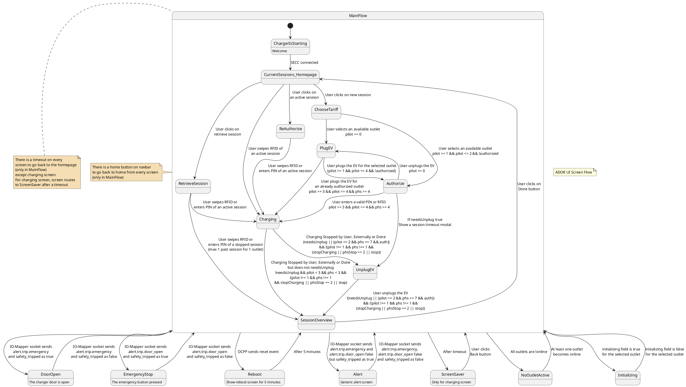

# ADOR display UI

UI frontend code for the ADOR display

## ADOR UI SCREEN FLOW

```plantuml
hide empty description
@startuml ui-screen-flow
note "ADOR UI Screen Flow" as title

DoorOpen : The charger door is open
EmergencyStop : The emergency button pressed
Reboot : Show reboot screen for 5 minutes
Alert : Generic alert screen
ScreenSaver : Only for charging screen

state MainFlow {
ChargerIsStarting: Welcome

[*] --> ChargerIsStarting
ChargerIsStarting --> CurrentSessions_Homepage : SECC connected

CurrentSessions_Homepage --> ChooseTariff : User clicks on new session
CurrentSessions_Homepage --> RetrieveSession : User clicks on\nretrieve session
CurrentSessions_Homepage --> ReAuthorize : User clicks on\nan active session
CurrentSessions_Homepage --> Charging : User swipes RFID of\nan active session

ChooseTariff --> PlugEV : User selects an available outlet\npilot == 0
ChooseTariff --> Authorize : User selects an available outlet\npilot >= 1 && pilot <= 2 && !authorized

PlugEV --> Authorize : User plugs the EV for the selected outlet\n(pilot >= 1 && pilot <= 4 && !authorized)
PlugEV --> Charging : User plugs the EV for\nan already authorized outlet\npilot >= 3 && pilot <= 4 && phs >= 4

Authorize --> PlugEV : User unplugs the EV\npilot == 0
Authorize --> Charging : User enters a valid PIN or RFID\npilot >= 3 && pilot <= 4 && phs >= 4
Authorize --> UnplugEV : If needsUnplug true\nShow a session timeout modal

Charging --> UnplugEV : Charging Stopped by User, Externally or Done \n(needsUnplug || (pilot == 2 && phs == 7 && auth))\n&& !(pilot !== 1 && phs !== 1 &&\n(stopCharging || phsStop == 2 || stop))
Charging --> SessionOverview : Charging Stopped by User, Externally or Done\nbut does not needsUnplug\n!needsUnplug && pilot < 3 && phs < 3 &&\n!(pilot !== 1 && phs !== 1\n&& stopCharging || phsStop == 2 || stop)

UnplugEV --> SessionOverview : User unplugs the EV\n!(needsUnplug || (pilot == 2 && phs == 7 && auth))\n&& !(pilot !== 1 && phs !== 1 &&\n(stopCharging || phsStop == 2 || stop))

SessionOverview --> CurrentSessions_Homepage : User clicks on\nDone button

ReAuthorize --> Charging : User swipes RFID or\nenters PIN of an active session

RetrieveSession --> SessionOverview : User swipes RFID or\nenters PIN of a stopped session\n(max 1 past session for 1 outlet)
RetrieveSession --> Charging : User swipes RFID or\nenters PIN of an active session
}
note left of MainFlow #Wheat : There is a timeout on every\nscreen to go back to the homepage\n(only in MainFlow)\nexcept charging screen.\nFor charging screen, screen routes\nto ScreenSaver after a timeout
note left of MainFlow #Wheat : There is a home button on navbar\nto go back to home from every screen\n(only in MainFlow)

MainFlow --> DoorOpen : IO-Mapper socket sends\nalert.trip.emergency\nand safety_tripped as true
DoorOpen --> MainFlow : IO-Mapper socket sends\nalert.trip.emergency\nand safety_tripped as false

MainFlow --> EmergencyStop : IO-Mapper socket sends\nalert.trip.door_open\nand safety_tripped as true
EmergencyStop --> MainFlow : IO-Mapper socket sends\nalert.trip.door_open\nand safety_tripped as false

MainFlow --> Reboot : OCPP sends reset event
Reboot --> MainFlow : After 5 minutes

MainFlow --> Alert : IO-Mapper socket sends\nalert.trip.emergency and\nalert.trip.door_open false\nbut safety_tripped as true
Alert --> MainFlow : IO-Mapper socket sends\nalert.trip.emergency, \nalert.trip.door_open false\nand safety_tripped as false

MainFlow --> NoOutletActive : All outlets are !online
NoOutletActive --> MainFlow : At least one outlet\nbecomes online

MainFlow --> Initializing : initializing field is true\nfor the selected outlet
Initializing --> MainFlow : initializing field is false\nfor the selected outlet

MainFlow --> ScreenSaver : After timeout
ScreenSaver --> MainFlow : User clicks\nBack button

@enduml
```

## Copyright

(c) 2020-2022 EcoG GmbH
